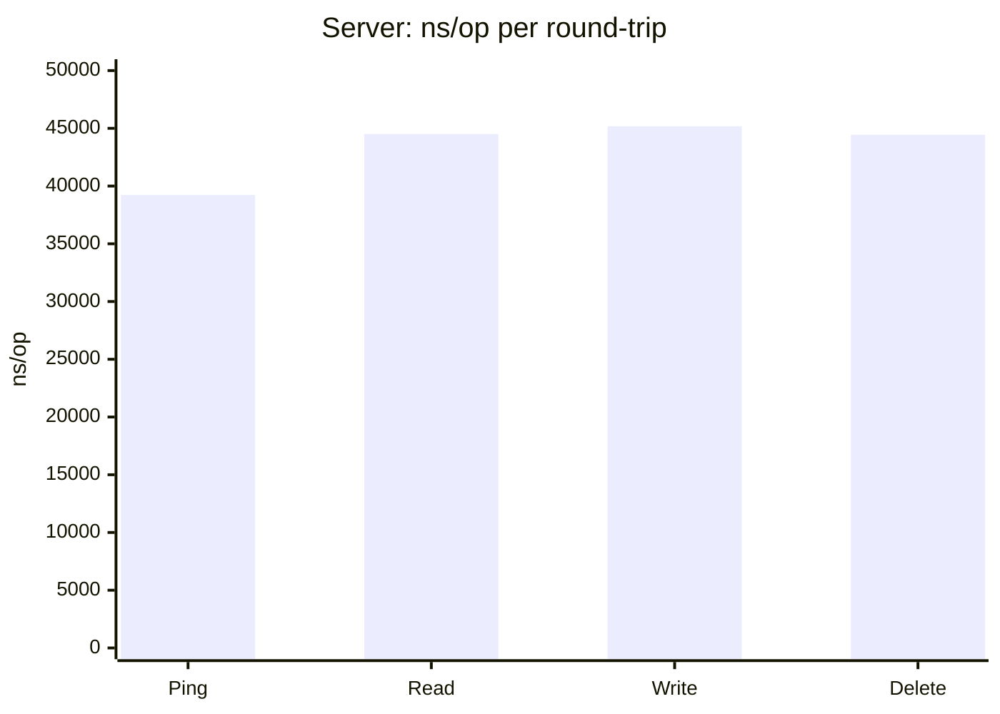
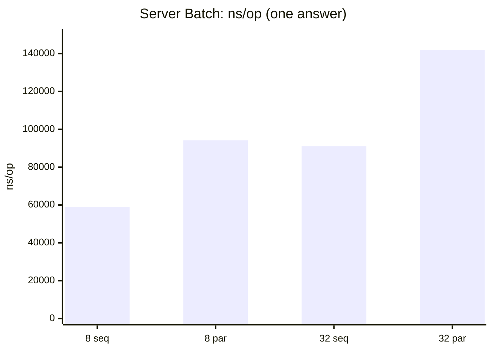
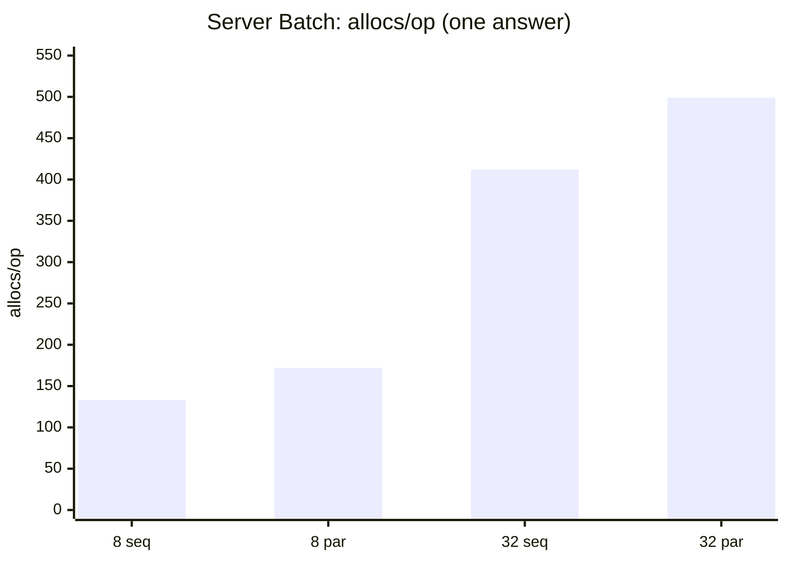
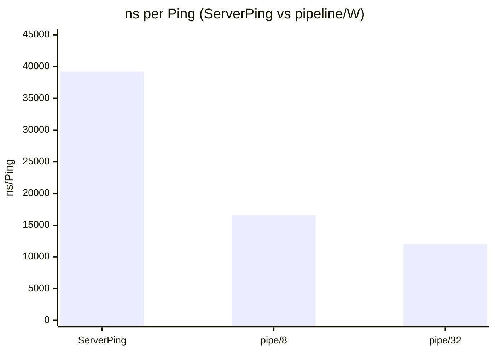
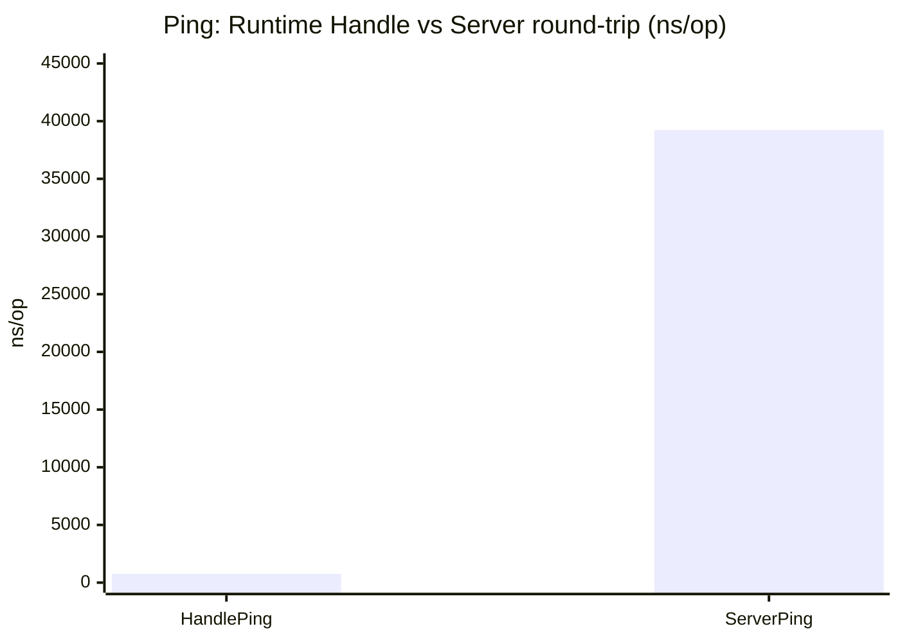
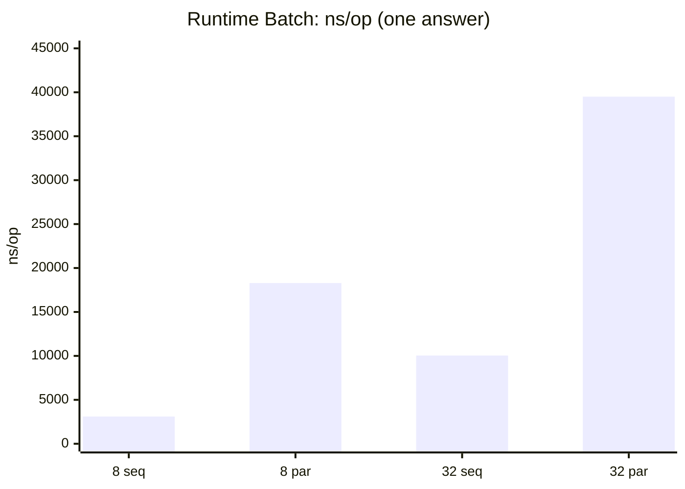
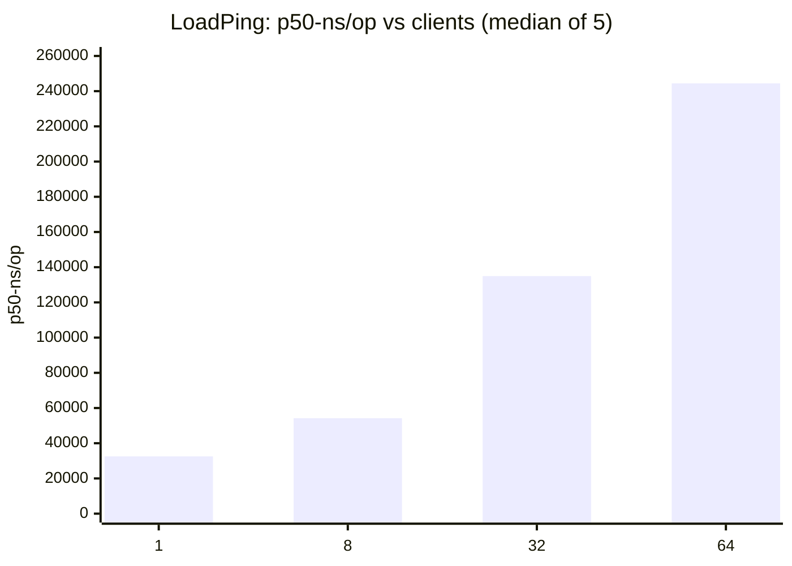
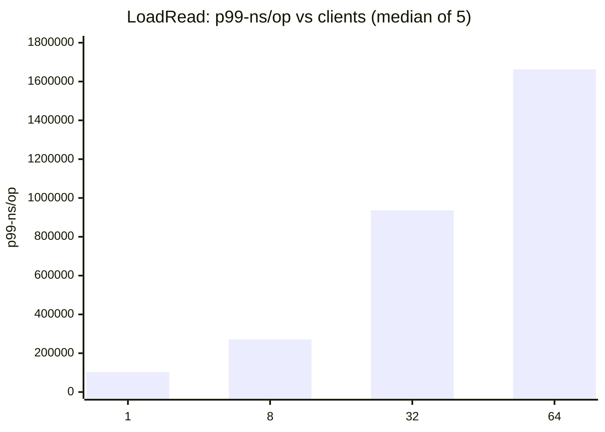

Language: [Русский](benchmarks.md) · [English](benchmarks.en.md)

# Benchmarks

This document defines the micro-benchmark suites, the unit of work (`op`), reference numbers, and a causal reading of the results. Architecture is in [how-it-works](how-it-works.en.md).

Two independent suites:

| Suite | Package | What is measured |
| --- | --- | --- |
| Server | `internal/server` | TCP + accept/read/write loops + runtime |
| Runtime | `internal/runtime/v1` | Decode / Activate / Handle / Ping without the network |

Do not compare absolute `ns/op` across suites: the server path includes the OS stack and connection goroutines.

Charts below use the reference tables in §3 (single run). They need a Mermaid renderer (GitHub, many IDEs).

---

## 1. Running

```bash
export GOMODCACHE="${GOMODCACHE:-$(go env GOPATH)/pkg/mod}"
# if needed: GOPROXY=off

go test -bench=. -benchmem ./internal/server/
go test -bench=. -benchmem ./internal/runtime/v1/

# load: fixed client count + p50/p99
go test -bench=ServerLoad -benchmem -count=5 -benchtime=200ms ./internal/server/
```

| Flag | Purpose |
| --- | --- |
| `-bench=NAME` | one benchmark or prefix |
| `-benchtime=DURATION` | duration / iteration budget |
| `-count=N` | independent runs |
| `-cpu=LIST` | `GOMAXPROCS` values |

Server benchmarks use large `PingInterval` / `PingTimeout` so idle Ping stays out of the timed loop.

Client helpers (`helpers_test.go`) use package-level `testV1Decoder` and `testV1Builder`: per-iteration `NewDecoder` / `NewFrameBuilder` are not counted in `-benchmem`. Remaining `allocs/op` cover encode buffers, body decode, the server path, and (for pipeline) the `pending` map.

---

## 2. Definition of one operation (`op`)

Metrics refer to one iteration of the benchmark body unless stated otherwise.

### 2.1. Server

Setup (dial, Hello, Handshake, Activate) is outside the timer.

| Benchmark | Work in one `op` |
| --- | --- |
| `BenchmarkServerPing` | 1× write Ping, 1× read PingAnswer |
| `BenchmarkServerRead` | 1× Read; handler `"ok:"+key` |
| `BenchmarkServerWrite` / `Delete` | 1× command; handler no-op |
| `BenchmarkServerPingParallel` | Ping under `b.RunParallel`; each worker has its own dial/activate |
| `BenchmarkServerLoadPing/clients=N` | 1× Ping+Answer; N pre-activated connections share `b.N` |
| `BenchmarkServerLoadRead/clients=N` | 1× Read+Answer; same fan-out across N clients |
| `BenchmarkServerBatch/n=N/MODE/one` | 1× Batch of N Reads, `OneAnswer=true` |
| `BenchmarkServerPingPipeline/window=W` | W× write Ping, then W× read Answer |

For pipeline, one `op` is a window of width W.

For Load, one `op` is one round-trip on one of N clients. `clients=N` is the number of concurrent TCP connections (not `GOMAXPROCS`). Extra metrics via `ReportMetric`: `p50-ns/op`, `p99-ns/op` (nearest-rank over latency samples). The standard `ns/op` at N>1 is wall-clock / `b.N` (a throughput metric), not median latency; use p50/p99 for latency.

### 2.2. Runtime

| Benchmark | Work in one `op` |
| --- | --- |
| `DecodePing` / `Activate` / `Handle*` | corresponding call without TCP |
| `RuntimePing` | idle `Ping` + decode + `Terminate` |
| `HandleReadCompressed*` | Read with compressed answer |
| `HandleBatch/…` | Batch; N, seq/parallel, one/multi |

`MB/s` is `SetBytes` / time; not TCP throughput.

---

## 3. Reference values

| Parameter | Value |
| --- | --- |
| Host | ThinkPad P52, Intel Core i7-8750H (6C/12T), x86_64 |
| OS / Go | linux, go1.27.1 |
| Command | `go test -bench=. -benchmem -count=1 -benchtime=200ms` |
| Modules | `GOPROXY=off`, local `GOMODCACHE` |

Single run. Not an SLA; re-measure on the target machine.

### 3.1. Server

| Benchmark | ns/op | B/op | allocs/op |
| --- | ---: | ---: | ---: |
| ServerPing | 39232 | 864 | 23 |
| ServerRead | 44511 | 1320 | 38 |
| ServerWrite | 45186 | 1328 | 34 |
| ServerDelete | 44436 | 1232 | 32 |
| Batch n=8 seq/one | 59087 | 4866 | 133 |
| Batch n=8 parallel/one | 94130 | 7932 | 172 |
| Batch n=32 seq/one | 91057 | 20470 | 412 |
| Batch n=32 parallel/one | 141965 | 25108 | 499 |
| PingPipeline window=8 | 132508 | 6918 | 191 |
| PingPipeline window=32 | 383375 | 27704 | 766 |

Load (`-bench=ServerLoad -count=5 -benchtime=200ms`; table = median of 5 runs):

| Benchmark | ns/op | p50-ns/op | p99-ns/op | B/op | allocs/op |
| --- | ---: | ---: | ---: | ---: | ---: |
| LoadPing clients=1 | 35965 | 32550 | 96761 | 864 | 23 |
| LoadPing clients=8 | 7549 | 54228 | 157996 | 864 | 23 |
| LoadPing clients=32 | 4888 | 134950 | 664433 | 863 | 23 |
| LoadPing clients=64 | 4600 | 244433 | 1247135 | 861 | 23 |
| LoadRead clients=1 | 41145 | 37715 | 103018 | 1319 | 38 |
| LoadRead clients=8 | 9367 | 65389 | 271141 | 1319 | 38 |
| LoadRead clients=32 | 6171 | 160272 | 936185 | 1318 | 38 |
| LoadRead clients=64 | 5901 | 296319 | 1662968 | 1314 | 37 |

Pipeline normalized (`/ W`):

| window | ns/Ping | B/Ping | allocs/Ping |
| --- | ---: | ---: | ---: |
| 8 | 16564 | 865 | 23.9 |
| 32 | 11980 | 865 | 23.9 |

### 3.2. Runtime

| Benchmark | ns/op | B/op | allocs/op | MB/s |
| --- | ---: | ---: | ---: | ---: |
| DecodePing | 1048 | 4292 | 6 | |
| Activate | 527 | 432 | 8 | |
| HandlePing | 762 | 232 | 5 | |
| HandleRead | 1146 | 560 | 11 | |
| HandleWrite | 1071 | 536 | 10 | |
| HandleDelete | 1049 | 536 | 10 | |
| RuntimePing | 1566 | 4474 | 11 | |
| HandleReadCompressed (~8 KiB) | 10508 | 21637 | 23 | 780 |
| HandleReadCompressedZstd (~164 KiB) | 75251 | 351134 | 15 | 2232 |
| Batch n=8 seq/one | 3104 | 1296 | 23 | |
| Batch n=8 parallel/one | 18290 | 4349 | 62 | |
| Batch n=32 seq/one | 10038 | 6468 | 55 | |
| Batch n=32 parallel/one | 39507 | 11066 | 142 | |

---

## 4. Charts (reference)

### 4.1. Server: single round-trip, ns/op



Read/Write/Delete stay close to Ping: with a light handler the fixed TCP round-trip and per-frame goroutine path dominate, not the command body.

### 4.2. Server: Batch ns/op



### 4.3. Server: Batch allocs/op



### 4.4. Ping: single vs normalized pipeline



### 4.5. Runtime Handle vs Server Ping



### 4.6. Runtime Batch: seq vs parallel, ns/op



### 4.7. Load Ping: p50 vs client count



### 4.8. Load Read: p99 vs client count



---

## 5. Why the numbers look this way

### 5.1. Server round-trip ≈ 40 µs while Handle ≈ 1 µs

Runtime `HandlePing` is a fraction of a microsecond. The same logical Ping on the server path is tens of microseconds.

A server `op` includes:

1. client `Encode` and `Write` on loopback TCP;
2. read loop: `SetReadDeadline`, `DecodePreamble`, `Decode`, `go serveV1Frame`;
3. Handle and answer encode;
4. enqueue on `answers`, `writeLoop` → coalesce / `net.Buffers.WriteTo`;
5. client `Read` + `DecodeFrame`.

Steps 1, 2, 4, and 5 are syscalls, buffer copies, and scheduler work. They dominate pure Handle by 1-2 orders of magnitude. That is why server Read/Write/Delete stay close to Ping: a no-op or short-string handler does not change the dominant term.

Server round-trip allocations (≈20-40) sum client encode/decode and the server path (`RequestID` registration, context, answer buffer). They are not “the cost of one map lookup”.

### 5.2. Pipeline: raw `ns/op` higher, normalized lower

Raw `PingPipeline/window=32` ≈ 383 µs looks worse than `ServerPing` ≈ 39 µs because one `op` is 32 ping+answer pairs.

After dividing by W:

- time per Ping drops (39 µs → ≈12-17 µs): while the client fills the window, the server already runs several `serveV1Frame` goroutines; `writeLoop` coalesces answers; answers are drained without a write/read turn per frame;
- `allocs/Ping` ≈ 24, same order as a single Ping: work scales with W, not super-linearly.

Growth of raw `B/op` and `allocs/op` with W (plus the per-window `pending` map) is expected and is not per-request degradation.

### 5.3. Batch: growth with N and a parallel penalty on no-op

**Growth with N.** One Batch holds N nested Reads. Each nested op parses a request, calls the handler, and records a result. The wire then carries one `BatchAnswer`. Hence near-linear growth in `allocs/op` and `B/op` (8→32: 133→412 allocs on server seq).

**Server vs Runtime.** Runtime Batch n=8 seq ≈ 3 µs / 23 allocs; server ≈ 59 µs / 133 allocs. The gap is again TCP, client encode of a large Batch frame, decode of a large BatchAnswer, and the `serveV1Frame` goroutine.

**Sequential faster than parallel on no-op.** Parallel starts up to `MaxGoroutinesPerBatch` workers, queue/result channels, and a `WaitGroup`. With a “return a string” handler that overhead exceeds useful work. The gap is clearest on runtime (3 µs seq vs 18 µs par for n=8). On the server, TCP dilutes the ratio, but parallel is still slower (59 vs 94 µs).

Parallel pays off when nested handlers wait on I/O or do CPU work above goroutine cost. These benchmarks do not model that regime.

**One-answer.** Server benches use `OneAnswer=true`: one reply frame on the wire. With `multi`, encode/write count would scale with N and bias comparison against a single round-trip.

### 5.4. Runtime compression

`HandleReadCompressed` (~8 KiB) and `…Zstd` (~164 KiB) measure answer encode with compression after Read. Higher `ns/op` and `B/op` come from compression buffers and the codec, not TCP. `MB/s` rises on the larger body as fixed overhead is amortized.

Compression applies only with registered compressors, Handshake intersection, and body ≥ threshold; Handshake/Ping/WriteAnswer/DeleteAnswer/error stay uncompressed (see how-it-works).

### 5.5. DecodePing: high B/op with few allocs

`DecodePing` ≈ 1 µs and 6 allocs, but ≈4 KiB/op. The decoder limit and temporary read/parse buffers produce volume with a small object count. That is short-frame decode behavior, not a connection leak.

### 5.6. Load: p50 rises with N while `ns/op` falls

`ServerLoad*` pre-activates N connections and splits `b.N` round-trips across them.

- **p50/p99** are per round-trip latency. As N grows, clients compete for CPU, the scheduler, and the server read/write loops; the `serveV1Frame` / `writeLoop` queue lengthens the tail. Reference (median of 5 runs) LoadPing p50: ≈33 µs (1 client) → ≈244 µs (64); p99 reaches milliseconds.
- **Go `ns/op`** is wall-clock / op count. With concurrent clients the wall time for a batch of `b.N` ops shrinks per op, so `ns/op` falls (throughput ↑) even though median latency rises. Do not read Load `ns/op` as “each request got faster”.
- **allocs/op** stay ≈ the same as single-connection Ping/Read: the per-request path is unchanged; concurrency changes, not allocation shape.
- **Vs `PingParallel`.** `b.RunParallel` picks worker count from `GOMAXPROCS`; Load fixes `clients=N` and prints percentiles.
- **Coalesce / timer.** Load keeps one inflight per client, so `answers` is rarely >1 and coalesce almost never shows up (usually `flushAfter` fires). The win is on pipeline and several outstanding answers on one conn; policy and constants are in [how-it-works §5.3](how-it-works.en.md#53-outbound-write).

### 5.7. What the reference does not cover

- disk/network-heavy handlers;
- TLS handshake and record layer (benches use plain TCP);
- full percentile spread (Load table is the median of 5 runs; p99 at 32–64 clients is still noisy);
- saturation well beyond 64 clients.

For steadier p99: longer `-benchtime` / higher `-count`, profiler if needed.

---

## 6. Comparison rules

1. Compare rows only when the `op` definition matches (§2). For pipeline use equal window width or the normalization in §3.1. For Load compare only equal `clients=`.
2. Do not treat server `ns/op` versus runtime `ns/op` as “Handle slowdown”.
3. Treat Batch growth with N as the cost of N nested ops plus the answer, not as fixed per-frame overhead regression.
4. Do not extrapolate parallel vs seq on no-op handlers to heavy handlers.
5. In Load use p50/p99 for latency; `ns/op` at `clients>1` is about throughput, not the median.
6. Only runs with the same `-benchtime`, `-count`, `-cpu`, and handler code are comparable.
