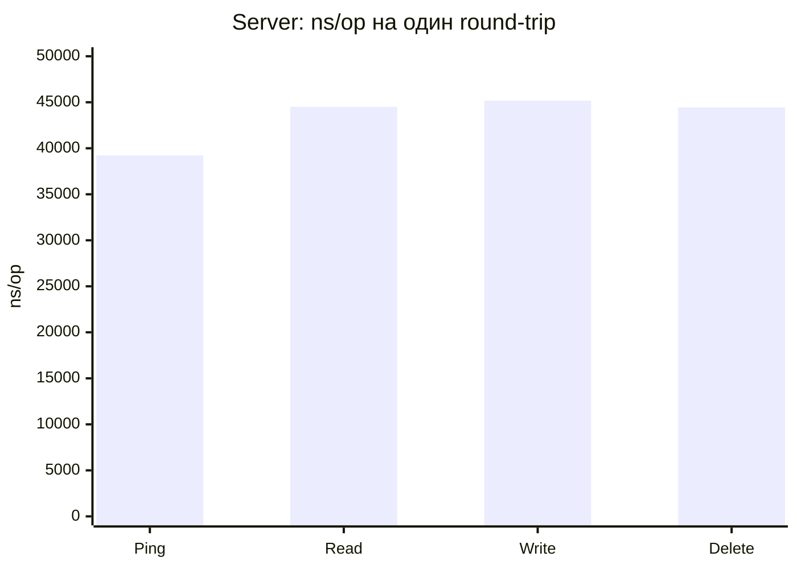
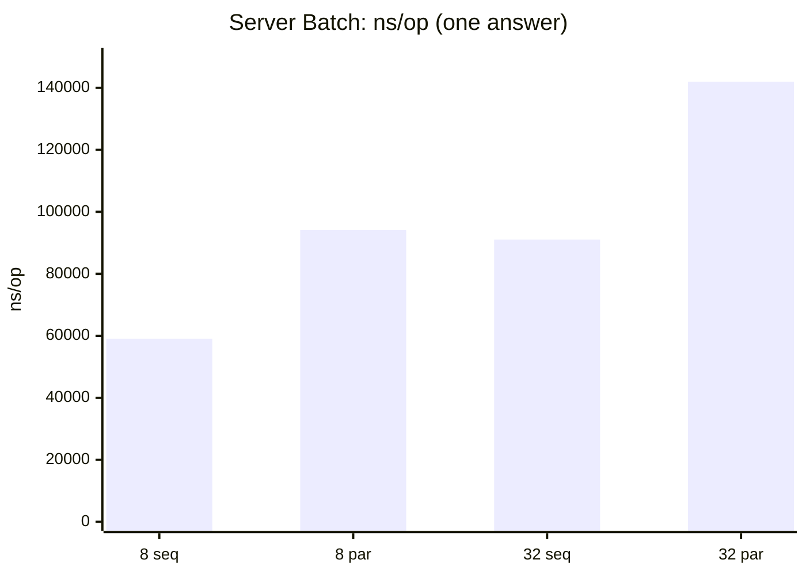
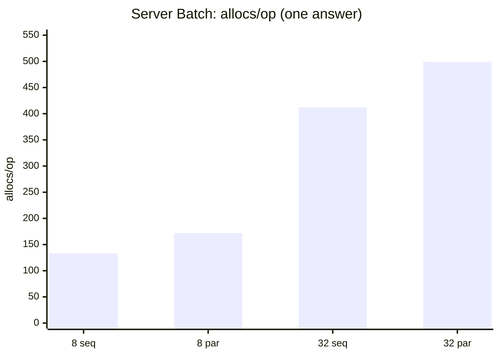
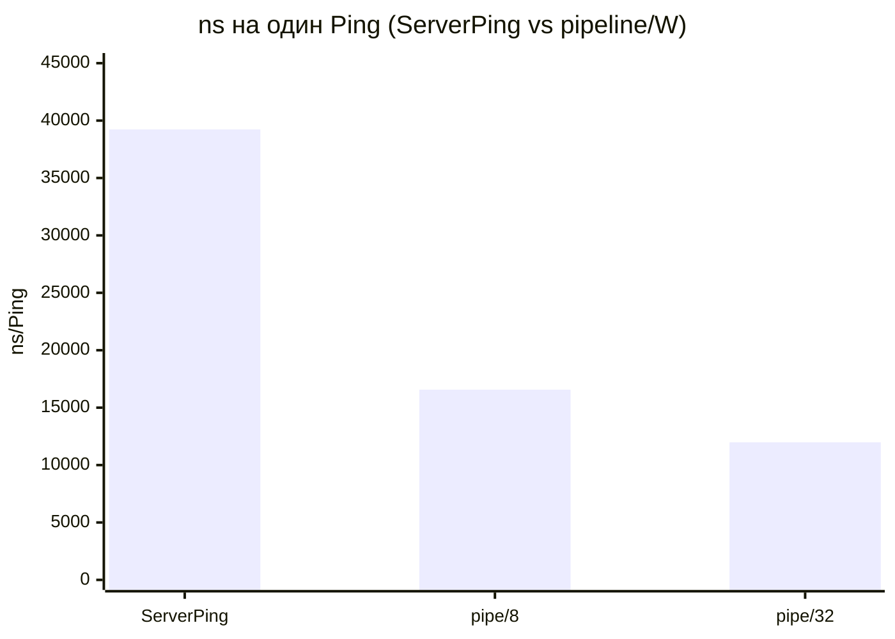
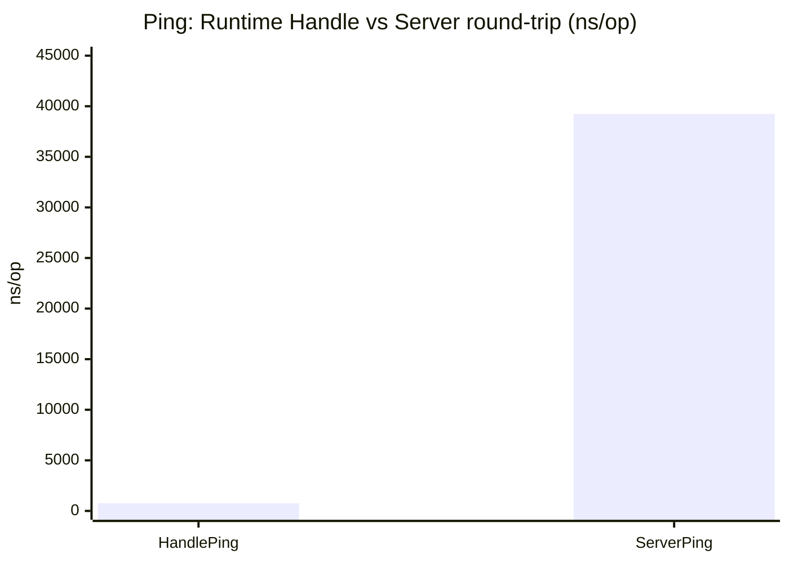
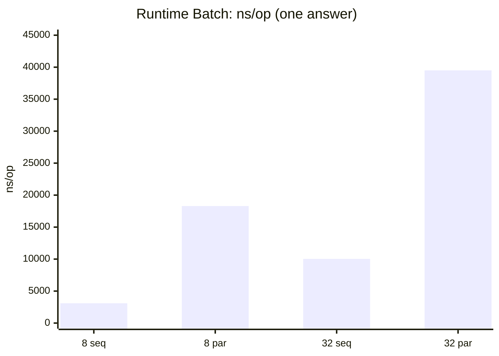
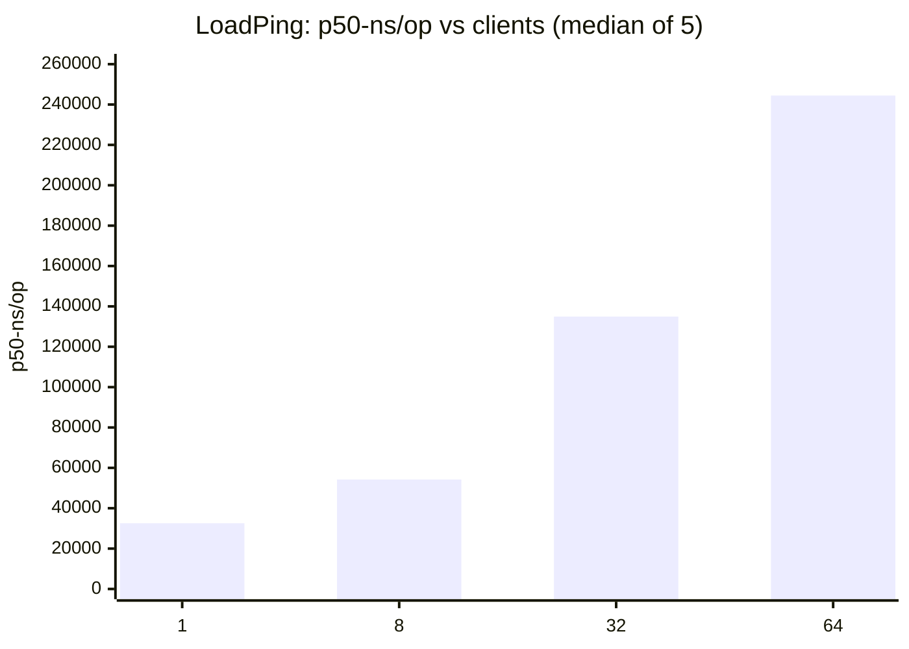
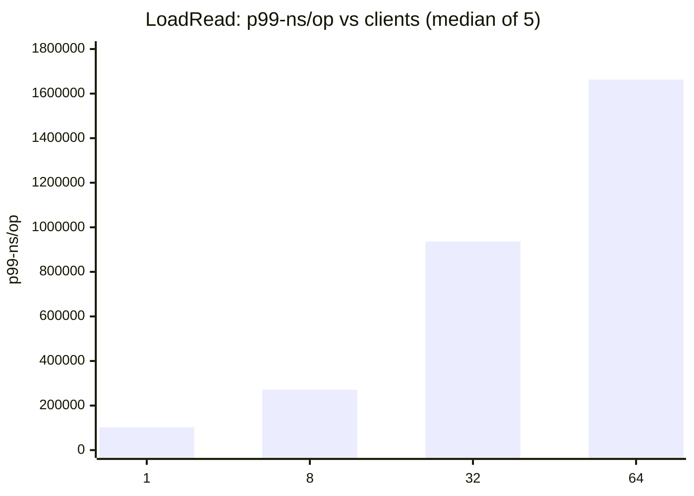

Язык: [Русский](benchmarks.md) · [English](benchmarks.en.md)

# Бенчмарки

Документ фиксирует состав микробенчмарков, единицу измерения (`op`), референсные значения и причинную интерпретацию результатов. Архитектура - в [how-it-works](how-it-works.md).

Два независимых набора:

| Набор | Пакет | Объект измерения |
| --- | --- | --- |
| Server | `internal/server` | TCP + accept/read/write loops + runtime |
| Runtime | `internal/runtime/v1` | Decode / Activate / Handle / Ping без сети |

Абсолютные `ns/op` между наборами напрямую не сравнивают: server включает стек ОС и горутины соединения.

Графики ниже построены по референсным таблицам §3 (один прогон). Для отображения нужен рендер Mermaid (GitHub, многие IDE).

---

## 1. Запуск

```bash
export GOMODCACHE="${GOMODCACHE:-$(go env GOPATH)/pkg/mod}"
# при необходимости: GOPROXY=off

go test -bench=. -benchmem ./internal/server/
go test -bench=. -benchmem ./internal/runtime/v1/

# нагрузка: фиксированное число клиентов + p50/p99
go test -bench=ServerLoad -benchmem -count=5 -benchtime=200ms ./internal/server/
```

| Флаг | Назначение |
| --- | --- |
| `-bench=NAME` | один бенчмарк или префикс |
| `-benchtime=DURATION` | длительность / число итераций |
| `-count=N` | независимые прогоны |
| `-cpu=LIST` | значения `GOMAXPROCS` |

В server-бенчмарках `PingInterval` / `PingTimeout` велики, idle Ping в цикл не входит.

Клиентские хелперы (`helpers_test.go`) используют пакетные `testV1Decoder` и `testV1Builder`: `NewDecoder` / `NewFrameBuilder` на итерацию в `-benchmem` не считаются. В `allocs/op` остаются encode буфера, decode тела, серверный путь и (для pipeline) структура `pending`.

---

## 2. Определение операции (`op`)

Метрики относятся к одной итерации тела бенчмарка, если не указано иное.

### 2.1. Server

Setup (dial, Hello, Handshake, Activate) вне таймера.

| Бенчмарк | Состав одного `op` |
| --- | --- |
| `BenchmarkServerPing` | 1× write Ping, 1× read PingAnswer |
| `BenchmarkServerRead` | 1× Read; хендлер `"ok:"+key` |
| `BenchmarkServerWrite` / `Delete` | 1× команда; хендлер no-op |
| `BenchmarkServerPingParallel` | Ping под `b.RunParallel`; у воркера свой dial/activate |
| `BenchmarkServerLoadPing/clients=N` | 1× Ping+Answer; N заранее активированных соединений делят `b.N` |
| `BenchmarkServerLoadRead/clients=N` | 1× Read+Answer; тот же fan-out по N клиентам |
| `BenchmarkServerBatch/n=N/MODE/one` | 1× Batch из N Read, `OneAnswer=true` |
| `BenchmarkServerPingPipeline/window=W` | W× write Ping, затем W× read Answer |

Для pipeline один `op` = окно ширины W.

Для Load один `op` = один round-trip на одном из N клиентов. `clients=N` - число одновременных TCP-соединений (не `GOMAXPROCS`). Дополнительно через `ReportMetric`: `p50-ns/op`, `p99-ns/op` (nearest-rank по сэмплам latency). Стандартный `ns/op` при N>1 - wall-clock / `b.N` (метрика пропускной способности), а не медиана latency; для latency смотреть p50/p99.

### 2.2. Runtime

| Бенчмарк | Состав одного `op` |
| --- | --- |
| `DecodePing` / `Activate` / `Handle*` | соответствующий вызов без TCP |
| `RuntimePing` | idle `Ping` + decode + `Terminate` |
| `HandleReadCompressed*` | Read с сжатием ответа |
| `HandleBatch/…` | Batch; N, seq/parallel, one/multi |

`MB/s` - `SetBytes` / время; не пропускная способность TCP.

---

## 3. Референсные значения

| Параметр | Значение |
| --- | --- |
| Хост | ThinkPad P52, Intel Core i7-8750H (6C/12T), x86_64 |
| ОС / Go | linux, go1.27.1 |
| Команда | `go test -bench=. -benchmem -count=1 -benchtime=200ms` |
| Модули | `GOPROXY=off`, локальный `GOMODCACHE` |

Один прогон. Не SLA; на целевой машине снимать заново.

### 3.1. Server

| Benchmark | ns/op | B/op | allocs/op |
| --- | ---: | ---: | ---: |
| ServerPing | 39232 | 864 | 23 |
| ServerRead | 44511 | 1320 | 38 |
| ServerWrite | 45186 | 1328 | 34 |
| ServerDelete | 44436 | 1232 | 32 |
| Batch n=8 seq/one | 59087 | 4866 | 133 |
| Batch n=8 parallel/one | 94130 | 7932 | 172 |
| Batch n=32 seq/one | 91057 | 20470 | 412 |
| Batch n=32 parallel/one | 141965 | 25108 | 499 |
| PingPipeline window=8 | 132508 | 6918 | 191 |
| PingPipeline window=32 | 383375 | 27704 | 766 |

Load (`-bench=ServerLoad -count=5 -benchtime=200ms`; в таблице медиана по 5 прогонам):

| Benchmark | ns/op | p50-ns/op | p99-ns/op | B/op | allocs/op |
| --- | ---: | ---: | ---: | ---: | ---: |
| LoadPing clients=1 | 35965 | 32550 | 96761 | 864 | 23 |
| LoadPing clients=8 | 7549 | 54228 | 157996 | 864 | 23 |
| LoadPing clients=32 | 4888 | 134950 | 664433 | 863 | 23 |
| LoadPing clients=64 | 4600 | 244433 | 1247135 | 861 | 23 |
| LoadRead clients=1 | 41145 | 37715 | 103018 | 1319 | 38 |
| LoadRead clients=8 | 9367 | 65389 | 271141 | 1319 | 38 |
| LoadRead clients=32 | 6171 | 160272 | 936185 | 1318 | 38 |
| LoadRead clients=64 | 5901 | 296319 | 1662968 | 1314 | 37 |

Нормировка pipeline (`/ W`):

| window | ns/Ping | B/Ping | allocs/Ping |
| --- | ---: | ---: | ---: |
| 8 | 16564 | 865 | 23.9 |
| 32 | 11980 | 865 | 23.9 |

### 3.2. Runtime

| Benchmark | ns/op | B/op | allocs/op | MB/s |
| --- | ---: | ---: | ---: | ---: |
| DecodePing | 1048 | 4292 | 6 | |
| Activate | 527 | 432 | 8 | |
| HandlePing | 762 | 232 | 5 | |
| HandleRead | 1146 | 560 | 11 | |
| HandleWrite | 1071 | 536 | 10 | |
| HandleDelete | 1049 | 536 | 10 | |
| RuntimePing | 1566 | 4474 | 11 | |
| HandleReadCompressed (~8 KiB) | 10508 | 21637 | 23 | 780 |
| HandleReadCompressedZstd (~164 KiB) | 75251 | 351134 | 15 | 2232 |
| Batch n=8 seq/one | 3104 | 1296 | 23 | |
| Batch n=8 parallel/one | 18290 | 4349 | 62 | |
| Batch n=32 seq/one | 10038 | 6468 | 55 | |
| Batch n=32 parallel/one | 39507 | 11066 | 142 | |

---

## 4. Графики (референс)

### 4.1. Server: одиночный round-trip, ns/op



Read/Write/Delete близки к Ping: при лёгком хендлере доминирует фиксированная стоимость TCP round-trip и горутинной обработки кадра, а не тело команды.

### 4.2. Server: Batch ns/op



### 4.3. Server: Batch allocs/op



### 4.4. Ping: одиночный vs нормированный pipeline



### 4.5. Runtime Handle vs Server Ping



### 4.6. Runtime Batch: seq vs parallel, ns/op



### 4.7. Load Ping: p50 vs число клиентов



### 4.8. Load Read: p99 vs число клиентов



---

## 5. Почему так (разбор результатов)

### 5.1. Server round-trip ≈ 40 µs при Handle ≈ 1 µs

На runtime `HandlePing` занимает доли микросекунды. На server тот же логический Ping - десятки микросекунд.

В server `op` входят:

1. клиентский `Encode` и `Write` в loopback TCP;
2. read-loop: `SetReadDeadline`, `DecodePreamble`, `Decode`, `go serveV1Frame`;
3. Handle и encode ответа;
4. постановка в канал `answers`, `writeLoop` → coalesce / `net.Buffers.WriteTo`;
5. клиентский `Read` + `DecodeFrame`.

Пункты 1, 2, 4, 5 - системные вызовы, копирование буферов, планирование горутин. Они на 1-2 порядка больше чистого Handle. Поэтому Read/Write/Delete на server почти не отличаются от Ping: хендлер no-op / короткая строка не меняет доминирующий член.

Аллокации server round-trip (≈20-40) - сумма клиентского encode/decode и серверного пути (регистрация `RequestID`, context, буфер ответа), не «стоимость одной строки в map».

### 5.2. Pipeline: сырой `ns/op` больше, нормированный - меньше

Сырой `PingPipeline/window=32` ≈ 383 µs выглядит хуже `ServerPing` ≈ 39 µs, потому что один `op` = 32 ping+answer.

После деления на W:

- время на Ping падает (39 µs → ≈12-17 µs): пока клиент дописывает окно, сервер уже крутит несколько `serveV1Frame`; `writeLoop` coalesce'ит ответы; ответы читаются без чередования write/read на каждый кадр;
- `allocs/Ping` ≈ 24, как у одиночного Ping: работа линейна по W, а не сверхлинейна.

Рост сырого `B/op` и `allocs/op` пропорционален W (плюс map `pending` на окно). Это ожидаемо и не означает деградацию на один запрос.

### 5.3. Batch: рост с N и штраф parallel при no-op

**Рост с N.** В одном Batch N вложенных Read. На каждую операцию: разбор nested request, вызов хендлера, запись результата в builder. Итог - один `BatchAnswer`. Отсюда почти линейный рост `allocs/op` и `B/op` (8→32: 133→412 allocs на server seq).

**Server vs Runtime.** Runtime Batch n=8 seq ≈ 3 µs / 23 allocs; server ≈ 59 µs / 133 allocs. Разница снова в TCP + клиентском encode большого Batch-кадра + decode большого BatchAnswer + горутина `serveV1Frame`.

**Sequential быстрее parallel на no-op.** Parallel поднимает до `MaxGoroutinesPerBatch` воркеров, каналы очереди/результатов, `WaitGroup`. При хендлере «вернуть строку» эта обвязка дороже полезной работы. На runtime разрыв особенно велик (3 µs seq vs 18 µs par для n=8). На server доля TCP сглаживает отношение, но parallel всё ещё медленнее (59 vs 94 µs).

Parallel оправдан, когда вложенные хендлеры ждут I/O или считают заметно дольше стоимости горутины. Данные бенчмарки этого режима не моделируют.

**One-answer.** Бенчмарки server используют `OneAnswer=true`: на проводе один ответный кадр. При `multi` число encode/write росло бы с N, и сравнение с одиночным round-trip было бы смещено.

### 5.4. Сжатие на runtime

`HandleReadCompressed` (~8 KiB) и `…Zstd` (~164 KiB) измеряют encode ответа с компрессией после Read. Рост `ns/op` и `B/op` связан с размером буферов сжатия и работой кодека, не с TCP. `MB/s` растёт на большем теле: постоянные накладные расходы амортизируются.

Сжатие включается только при зарегистрированных компрессорах, пересечении с Handshake и теле ≥ порога; Handshake/Ping/WriteAnswer/DeleteAnswer/error не сжимаются (см. how-it-works).

### 5.5. DecodePing: высокий B/op при малом allocs

`DecodePing` ≈ 1 µs, 6 allocs, но ≈4 КиБ/op. Лимит декодера и временные буферы чтения/разбора дают объём аллокаций при небольшом числе объектов. Это характеристика протокол-декодера на коротком кадре, не утечка на соединении.

### 5.6. Load: p50 растёт с N, а `ns/op` падает

`ServerLoad*` поднимает заранее N соединений и делит `b.N` round-trip между ними.

- **p50/p99** - latency одного round-trip. С ростом N клиенты конкурируют за CPU, планировщик и серверные read/write loops; очередь `serveV1Frame` и `writeLoop` удлиняет хвост. На референсе (медиана 5 прогонов) LoadPing p50: ≈33 µs (1 клиент) → ≈244 µs (64); p99 уходит в миллисекунды.
- **`ns/op` Go** - wall-clock / число ops. При параллельных клиентах стена времени на batch из `b.N` ops короче в пересчёте на op, поэтому `ns/op` падает (throughput ↑), хотя медиана latency растёт. Не читать Load `ns/op` как «запрос стал быстрее».
- **allocs/op** остаются ≈ как у одиночного Ping/Read: путь на запрос тот же, меняется конкуренция, не состав аллокаций.
- **Vs `PingParallel`.** `b.RunParallel` выбирает число воркеров от `GOMAXPROCS`; Load явно фиксирует `clients=N` и печатает перцентили.
- **Coalesce / таймер.** Load держит один inflight на клиента, поэтому `answers` редко >1 и выигрыш coalesce почти не виден (часто срабатывает `flushAfter`). Выигрыш - на pipeline и нескольких outstanding на одном conn; политика и константы - в [how-it-works §5.3](how-it-works.md#53-исходящая-запись).

### 5.7. Что референс не показывает

- дисковый/сетевой хендлер;
- TLS handshake и record layer (бенчи на plain TCP);
- полный разброс перцентилей (в таблице Load - медиана по 5 прогонам; p99 на 32–64 клиентах всё ещё шумит);
- насыщение далеко за 64 клиентами.

Для ещё более устойчивых p99: больший `-benchtime` / `-count`, при необходимости профилировщик.

---

## 6. Правила сравнения

1. Сравнивать строки только с одинаковым определением `op` (§2). Pipeline - по равной ширине окна или по нормировке §3.1. Load - только при одинаковом `clients=`.
2. Не сравнивать server `ns/op` с runtime `ns/op` как «замедление Handle».
3. Рост Batch с N трактовать как стоимость N nested ops + ответ, а не как регрессию fixed overhead на кадр.
4. Parallel vs seq на no-op не экстраполировать на тяжёлые хендлеры.
5. В Load для latency использовать p50/p99; `ns/op` при `clients>1` - про пропускную способность, не про медиану.
6. Сопоставимы прогоны с одинаковыми `-benchtime`, `-count`, `-cpu` и кодом хендлера.
